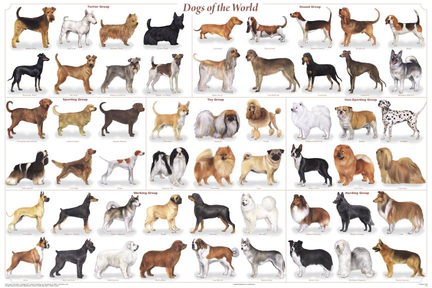

# Computer_Vision
August 13th

Duong Vu


This is the folder storing all exploration of Computer Vision techniques and libraries


## [1st notebook](Exploration_of_CV): Image Classification of Dog and Cat


- Displaying image using Matplotlib, PIL and OpenCV

- Exploring the training and test set

- Creating Convolution Neural Network and test with some validation image

-  Using TensorBoard to track the process.

  

## 2nd notebook: Object Detection and Feature Engineer


- Manually detect object in an image
- Extract features from an image - potentially for prediction purpose.


### 3rd notebook: Good boys classification

- Dog Breed Classification




For log files, open using TensorBoard by typing below command in your terminal in where the log folder is:

```
tensorboard --logdir=logs
```

### Dependencies

- [numpy](http://www.numpy.org/)
- [matplotlib](https://matplotlib.org/index.html)
- [keras](https://keras.io/)
- [OpenCV](https://opencv.org/)
- [pillow](https://pillow.readthedocs.io/en/latest/)

